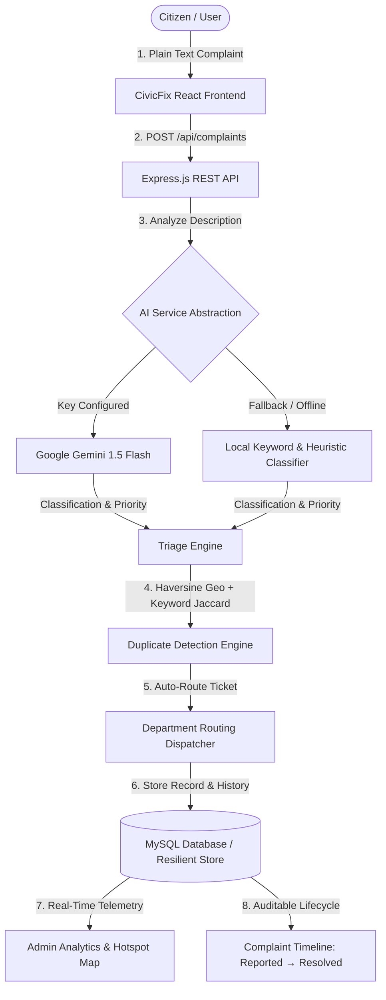

# CivicFix — AI-Powered Civic Complaint Management System

> **A Hackathon Prototype Aligned with UN SDG 11 (Sustainable Cities and Communities) & UN SDG 16 (Peace, Justice and Strong Institutions)**

---

## 🏛️ Project Overview

**CivicFix** is an end-to-end civic complaint management platform that bridges the gap between citizens and municipal municipal engineering departments. Using advanced Natural Language Processing (Google Gemini API with a local rule-based fallback system), CivicFix automatically understands the nature of citizen complaints in plain language, assigns appropriate safety priorities, routes tickets directly to municipal work squads, screens for duplicate complaints, and renders geospatial hotspots on interactive OpenStreetMap interfaces.

---

## 🎯 Problem Statement & Solution

### The Problem
* **Bureaucratic Latency**: Citizens struggle to navigate obscure municipal department structures and bureaucratic category lists.
* **Opaque Progress**: Complaints disappear into administrative black holes with no transparency or audit trail.
* **Duplicate Backlogs**: Identical issues (e.g., a burst pipe or deep pothole on a busy road) trigger hundreds of repetitive complaints, overwhelming city staff.
* **Lack of Predictive Spatial Intelligence**: City authorities lack real-time hotspot detection to address infrastructural hazards before they cause casualties.

### The CivicFix Solution
* **Zero-Bureaucracy Intake**: Citizens report complaints in plain text; AI extracts category, subcategory, keywords, severity, and routing automatically.
* **Autonomous Department Routing**: Automatically connects complaints to Electrical, Roads, Sanitation, Water Supply, Public Works, or Traffic departments.
* **Real Multi-Factor Duplicate Detection**: Uses Haversine distance, category weighting, and keyword Jaccard overlap to detect similar complaints in the vicinity.
* **Auditable Timeline Redressal**: Immutable status progression (`REPORTED` → `AI ANALYZED` → `ASSIGNED` → `IN PROGRESS` → `RESOLVED`) with officer attribution.
* **Spatial Hotspots on OpenStreetMap**: Interactive Leaflet maps highlighting density clusters and categories without requiring proprietary Google Maps API keys.

---

## 🌍 UN Sustainable Development Goals (SDGs) Alignment

| Goal | Target Alignment | CivicFix Implementation |
|---|---|---|
| **UN SDG 11: Sustainable Cities and Communities** | **Target 11.2**: Safe transport & road safety<br>**Target 11.6**: Environmental & waste reduction<br>**Target 11.7**: Inclusive safe public spaces | High-priority rapid escalation for hazardous potholes and broken traffic signals; geocoded waste overflow mapping; immediate identification of unlit roads to protect women and students. |
| **UN SDG 16: Peace, Justice & Strong Institutions** | **Target 16.6**: Effective, accountable, transparent institutions<br>**Target 16.7**: Responsive & inclusive decision-making<br>**Target 16.10**: Public access to information | Transparent timeline tracking with officer attribution; open city problem analytics; duplicate linking empowering collective citizen petitions. |

---

## 💻 Tech Stack

### Frontend
* **React 18** + **Vite 6**
* **Tailwind CSS** (Modern, clean, minimal civic tech design system)
* **Leaflet & OpenStreetMap** (Zero Google Maps API keys required)
* **Recharts** (Interactive administrative & analytics charts)
* **Lucide React Icons**

### Backend
* **Node.js** + **Express.js** (ES Modules)
* **JWT (JSON Web Tokens)** + **bcryptjs** (Secure authentication & role authorization)
* **CORS**, **dotenv**

### Database
* **MySQL 8.0+ / MariaDB** (Production schema with foreign keys, indexes, and cascades)
* **Resilient Embedded Data Store Adapter**: Automatically detects if MySQL is running; if not, activates built-in persistent storage so the hackathon demo **never fails or crashes**.

### Artificial Intelligence & NLP
* **Google Gemini API** (`@google/generative-ai`)
* **Local Fallback NLP Engine**: Rule-based keyword extraction and priority classification guaranteed to work out-of-the-box even without an active `GEMINI_API_KEY`.

---

## 🏗️ System Architecture



---

## 📂 Project Structure

```
civicfix/
│
├── client/                      # React + Vite Frontend
│   ├── public/
│   ├── src/
│   │   ├── components/          # Navbar, Footer, Timeline, LeafletMap, StatusBadge, PriorityBadge, DuplicateWarningModal
│   │   ├── context/             # AuthContext (JWT session state)
│   │   ├── pages/               # 12 Full Application Pages
│   │   │   ├── LandingPage.jsx
│   │   │   ├── LoginPage.jsx
│   │   │   ├── RegisterPage.jsx
│   │   │   ├── CitizenDashboard.jsx
│   │   │   ├── SubmitComplaintPage.jsx
│   │   │   ├── ComplaintDetailsPage.jsx
│   │   │   ├── MyComplaintsPage.jsx
│   │   │   ├── AdminDashboard.jsx
│   │   │   ├── ComplaintManagementPage.jsx
│   │   │   ├── AnalyticsPage.jsx
│   │   │   ├── HotspotMapPage.jsx
│   │   │   └── AboutSdgPage.jsx
│   │   ├── services/            # API client (fetch wrapper)
│   │   ├── index.css            # Tailwind directives & Leaflet styling
│   │   ├── App.jsx              # Application router
│   │   └── main.jsx
│   ├── index.html
│   ├── package.json
│   ├── tailwind.config.js
│   ├── postcss.config.js
│   └── vite.config.js
│
├── server/                      # Node.js + Express Backend
│   ├── config/                  # config.js, db.js (MySQL + Resilient Store)
│   ├── controllers/             # authController, complaintController, analyticsController, aiController
│   ├── middleware/              # authMiddleware, errorHandler
│   ├── models/                  # dbAdapter (Unified repository)
│   ├── routes/                  # authRoutes, complaintRoutes, analyticsRoutes, aiRoutes
│   ├── services/                # aiService (Gemini + Local Fallback), duplicateDetector, routingService
│   ├── data/                    # JSON persistence cache when MySQL is offline
│   ├── .env.example
│   ├── .env
│   ├── package.json
│   └── server.js
│
├── database/
│   ├── schema.sql               # MySQL DDL (users, complaints, complaint_keywords, complaint_duplicates, status_history)
│   └── seed.sql                 # Realistic demo dataset (16 complaints across 6 categories)
│
├── .env.example
├── package.json                 # Root runner scripts
├── start-dev.js                 # Concurrent dev launcher
└── README.md
```

---

## ⚡ Quick Setup & Running (Windows + VS Code)

### Prerequisites
* **Node.js** (v18 or higher recommended; verified on Node v24)
* **npm** (v9 or higher)
* *(Optional)* **MySQL 8.0+** (if you wish to use native MySQL instead of the resilient zero-config embedded store)

### 1. Installation
Clone or navigate to the project directory:
```powershell
cd C:\Users\Suhas\.gemini\antigravity\scratch\civicfix
```

Install server and client packages:
```powershell
# Option A: From root using unified script
npm run install:all

# Option B: Or individually
cd server; npm install
cd ../client; npm install
cd ..
```

---

### 2. Environment Variables (.env)

The application includes `.env.example` in both the root and `server/` directories:
```ini
PORT=5000
GEMINI_API_KEY=your_api_key_here
DB_HOST=localhost
DB_PORT=3306
DB_USER=root
DB_PASSWORD=your_password
DB_NAME=civicfix
JWT_SECRET=civicfix_super_secure_jwt_secret_key_2026
```

> **Note on Gemini API**: If `GEMINI_API_KEY` is not provided, the application **automatically uses the local fallback NLP classification engine**. The hackathon demo will work 100% reliably.

---

### 3. Database Setup (Optional MySQL)

If you have MySQL installed and running:
```powershell
mysql -u root -p < database/schema.sql
mysql -u root -p < database/seed.sql
```
*If MySQL is not installed or running, CivicFix automatically boots into its embedded store with the identical seed data and zero errors.*

---

### 4. Running the Application

From the root directory, simply run:
```powershell
npm run dev
```

Or run frontend and backend in separate terminal tabs:
* **Terminal 1 (Backend)**:
  ```powershell
  cd server
  npm run dev
  # Server running at http://localhost:5000
  ```
* **Terminal 2 (Frontend)**:
  ```powershell
  cd client
  npm run dev
  # Frontend running at http://localhost:5173
  ```

Open your browser at: **`http://localhost:5173`**

---

## 🔑 Demo Credentials

| Role | Email | Password | Access Capabilities |
|---|---|---|---|
| **Citizen (Demo)** | `citizen@example.com` | `citizen123` | Submit grievances, live AI analysis, view My Complaints, track status |
| **Admin Officer** | `admin@civicfix.gov` | `admin123` | Executive dashboard, Recharts analytics, manage all tickets, update status |
| **Electrical Officer** | `officer.electrical@civicfix.gov` | `admin123` | Manage & dispatch electrical/streetlight complaints |
| **Roads Supervisor** | `officer.roads@civicfix.gov` | `admin123` | Manage pothole & asphalt repair tickets |

*(The login page includes 1-click demo login buttons for immediate evaluator testing)*

---

## 🎬 Step-by-Step Hackathon Demonstration Script

Follow this exact flow to demonstrate all required capabilities:

1. **Open Landing Page** (`http://localhost:5173`):
   * Review Hero: *"Report. Resolve. Improve Your City."*
   * Observe SDG 11 & SDG 16 badges and workflow diagram.
2. **Citizen Login**:
   * Click **Login** → Click **"Demo Citizen"** (auto-fills `citizen@example.com` / `citizen123`).
   * Land on Citizen Dashboard showing personal complaints.
3. **Submit Complaint**:
   * Click **"Report Issue"** in the top navigation.
   * In description, enter or click the preset button:
     > *"Streetlight near my college has been broken for 2 weeks."*
   * **Observe Live AI Triage**:
     * Category automatically detected: **Infrastructure**
     * Subcategory: **Streetlight**
     * Priority: **MEDIUM**
     * Routing: **Electrical Department**
     * Keywords: `#streetlight`, `#college`, `#broken`, `#night`, `#visibility`
   * Click **"Submit Complaint"**:
     * **Duplicate Detection Warning** appears! Alert shows existing college streetlight issues (e.g. `CIV-2026-0001` with ~79% similarity).
     * Click **"Submit Anyway as New Complaint"**.
4. **Complaint Details & Timeline**:
   * Unique Complaint ID displayed (e.g., `CIV-2026-0017`).
   * See interactive Leaflet map pin.
   * Observe live resolution timeline:
     * ✓ Complaint Submitted
     * ✓ AI Analyzed & Triaged
     * ✓ Assigned to Electrical Department
     * ○ In Progress
     * ○ Resolved
5. **Switch to Admin Account**:
   * Click Logout → Click **"Demo Admin"** (`admin@civicfix.gov` / `admin123`).
   * Arrive on **Admin Dashboard**:
     * View live KPIs: Total Complaints, Open, Resolved, High Priority, Avg Turnaround.
     * View 6 interactive Recharts charts (Category, Priority, Department, Over Time, Status Flow, Resolution Rate).
6. **Update Complaint Status**:
   * Click **Complaints** in nav (`/admin/complaints`).
   * Find the newly created complaint `CIV-2026-0017`.
   * Click **"Mark In Progress"** → status updates in real time.
   * Open the complaint details → in Officer Actions, select **RESOLVED**, add note: *"Replaced LED ballast fixture"*, and click **Apply Status Update**.
   * Observe the timeline step turn green: **Problem Resolved** with completion timestamp!
7. **Verify Analytics & Trends**:
   * Click **Analytics** (`/analytics`).
   * Observe updated resolution percentage, top reported issue, most affected area, and dynamic **"City Problem Insights"**.
8. **Inspect Hotspot Map**:
   * Click **Hotspot Map** (`/map`).
   * Observe OpenStreetMap with color-coded category markers (Amber for Streetlight, Red for Pothole, Emerald for Garbage, etc.) and glowing red hotspot density circles around clustered complaint locations.

---

## 📡 REST API Reference

### Authentication
* `POST /api/auth/register` — Register a citizen or officer account
* `POST /api/auth/login` — Sign in and receive JWT token
* `GET /api/auth/me` — Retrieve active session profile

### Complaints
* `POST /api/complaints` — Submit a complaint (triggers AI analysis, duplicate check, and routing)
* `GET /api/complaints` — Filter complaints (query: `status`, `priority`, `category`, `department`, `search`, `userId`)
* `GET /api/complaints/:id` — Retrieve full complaint details, keywords, duplicates, and timeline
* `PUT /api/complaints/:id` — Update complaint metadata / reassign department
* `PUT /api/complaints/:id/status` — Transition complaint status and record audit log in `status_history`
* `DELETE /api/complaints/:id` — Delete complaint (Admin only)
* `GET /api/complaints/map` — Geo-coordinates and metadata for Leaflet map markers

### AI & NLP
* `POST /api/ai/analyze` — Live NLP classification preview
* `POST /api/ai/check-duplicates` — Screen for duplicate complaints before submission

### Analytics
* `GET /api/analytics/summary` — Aggregate counts, resolution rate, and avg resolution time
* `GET /api/analytics/categories` — Distribution by category
* `GET /api/analytics/departments` — Department workload and resolution percentage
* `GET /api/analytics/trends` — Timeline data, status breakdown, and dynamic City Problem Insights

---

## 🔮 Future Enhancements

1. **Multilingual Voice Intake**: Support for local vernacular speech-to-text so citizens can dictate complaints via audio.
2. **Automated WhatsApp/SMS Integration**: Real-time SMS and WhatsApp bots for status alerts and complaint submission.
3. **Computer Vision Verification**: Automated before/after photo comparison to automatically verify that pothole or garbage fixes were completed properly.
4. **Predictive Municipal Maintenance**: Machine learning forecasting to predict infrastructure failures based on weather patterns and age of assets.
